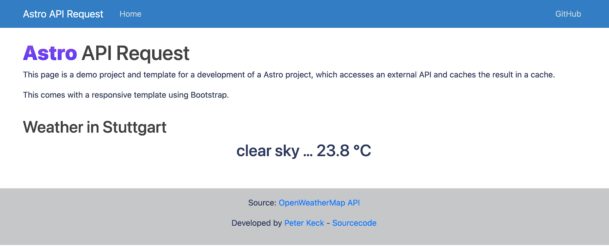

<h1 align="center">Welcome to Astro-api-request 👋</h1>
<p>
  
  <a href="https://github.com/pyrrolizin/flask-api-request/blob/master/LICENSE" target="_blank">
    
  </a>
</p>


>This project is a starting platform for a Astro project that pulls data from an external API and caches the result. 
>The project includes a responsive Bootstrap template.

## 🏠 [Homepage](https://github.com/pyrrolizin/astro-api-request)

## ✨ Demo (OpenWeatherMap-Api - Current weather in Stuttgart, Germany)

tbd



## Prerequisit

* Node.js >= 16
* npm

## Install

```sh
npm i
```

### Environment varaibles

You can set the following environment variables:

| NAME        |  *required*  |  Comment  |
| ----------- | ------------ | --------- |
| `API_KEY`   | **yes**      |  You can get your own free OpenWeatherApi key on this website: https://home.openweathermap.org/users/sign_up  |

You can either set the environment variables or use the `.env` file:
Make your own copy of the `.env` file and specify the `.env` and add the keys. 

```sh
cp ./.env_default ./.env
```

Learn more about the OpenWeatherMap API: https://openweathermap.org/api

## Getting Started

First, run the development server:

```bash
npm run dev
```

Open [http://localhost:3000](http://localhost:3000) with your browser to see the result.

## 🚀 Project Structure

Inside of your Astro project, you'll see the following folders and files:

```
/
├── public/
│   └── favicon.svg
├── src/
│   ├── components/
│   │   └── Card.astro
│   ├── layouts/
│   │   └── Layout.astro
│   └── pages/
│       └── index.astro
└── package.json
```

Astro looks for `.astro` or `.md` files in the `src/pages/` directory. Each page is exposed as a route based on its file name.

There's nothing special about `src/components/`, but that's where we like to put any Astro/React/Vue/Svelte/Preact components.

Any static assets, like images, can be placed in the `public/` directory.

## 🧞 Commands

All commands are run from the root of the project, from a terminal:

| Command                | Action                                             |
| :--------------------- | :------------------------------------------------- |
| `npm install`          | Installs dependencies                              |
| `npm run dev`          | Starts local dev server at `localhost:3000`        |
| `npm run build`        | Build your production site to `./dist/`            |
| `npm run preview`      | Preview your build locally, before deploying       |
| `npm run astro ...`    | Run CLI commands like `astro add`, `astro preview` |
| `npm run astro --help` | Get help using the Astro CLI                       |

## 👀 Want to learn more?

Feel free to check [our documentation](https://docs.astro.build) or jump into our [Discord server](https://astro.build/chat).
